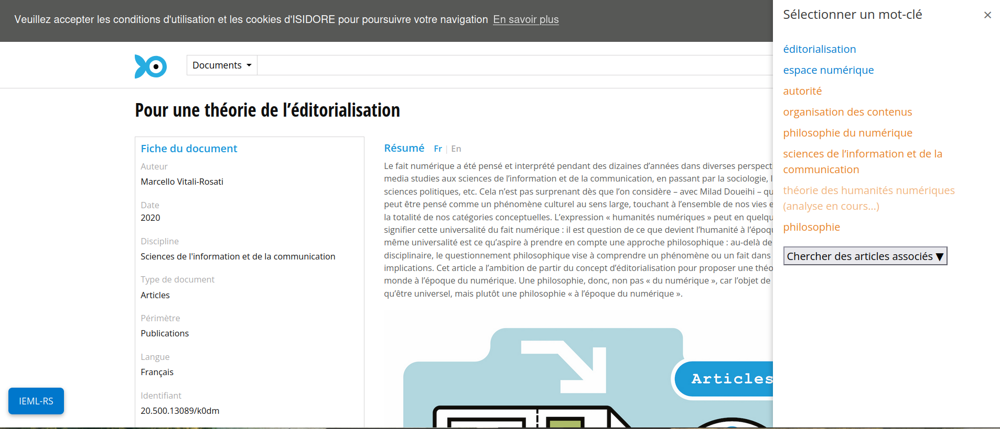
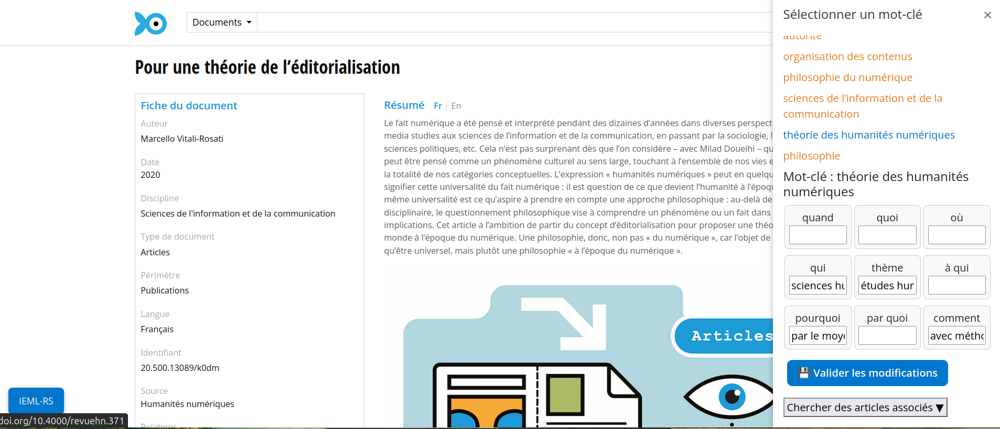
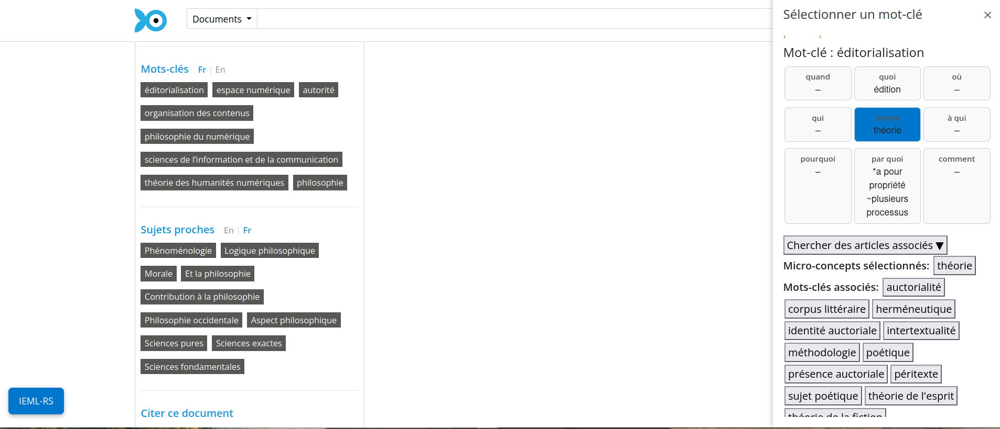
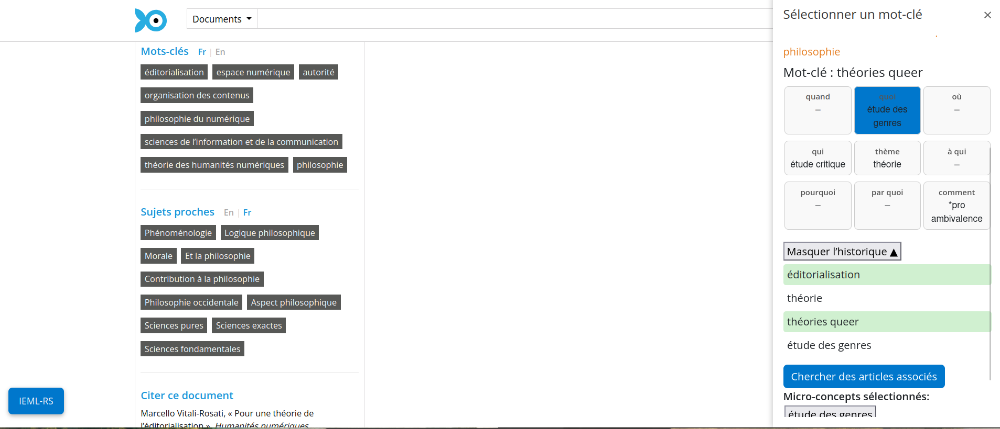

# IEML-RS

Recommender system for Isidore based on IEML ontology navigation from seed article keywords. Compare retrieved articles from simple keyword search and an LLM-augmented query. 

It is a Firefox extension that only works on [https://isidore.science](https://isidore.science) articles.

## How to use

Complete explanation published in [Revue3.0 blog](https://revue30.org/blog/presentation-ieml-rs) ! 

After installation go to [Isidore](https://isidore.science) and look for an article. On the bottom left corner should appear a button 'IEML-RS'. 

 and one from a query-augmented search (2nd panel)")

## Install

### addons.mozilla

https://addons.mozilla.org/fr/firefox/addon/ieml-rs/

### manual installation

1. Download the latest version in `version` dir. (`xpi` file)

2. Enter about:addons in your browser. 

3. In the paramters, select 'import a module from a file' and select the `xpi` file.

## Content description

`src`:

- `src/script.js`: extension script 
- `src/manifest.json`: Firefox extension manifest. 

Content of `src` must be compressed into a zip file to be converted into xpi when added to the Firefox catalog.

`wrangler`:

- `wrangler/index.js`: proxy endpoint to Isidore, Together AI and Crossref. + Data store of all things contained in `data`. 

`data`: 

- `data.csv`: original 400 words translated in IEML (updated with /saveKeyword API endpoint)
- `embd_full.tar.xz`: embeddings of the [IEML dictionnary](https://ieml.intlekt.io/) (by word) 

`rag-eval`: detailed in `rag_evaluation_report.md`. 
